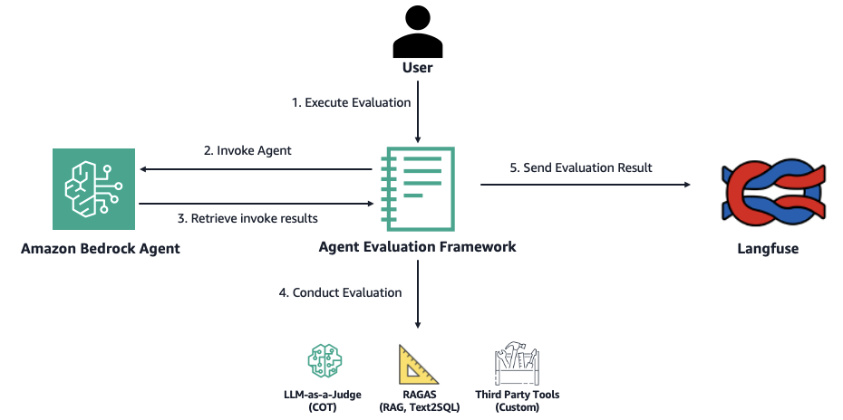
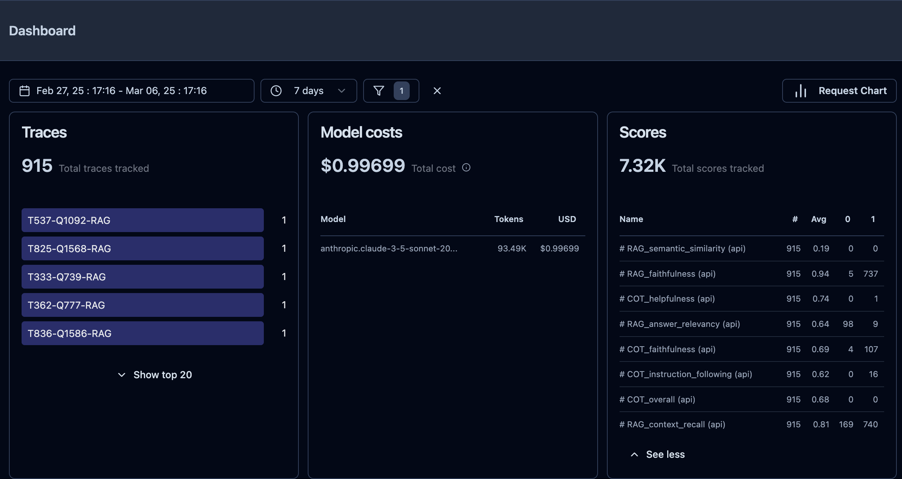
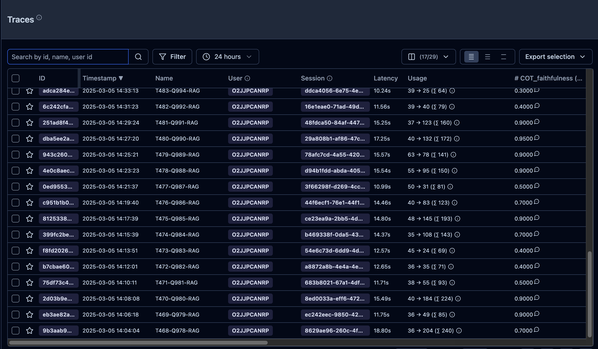
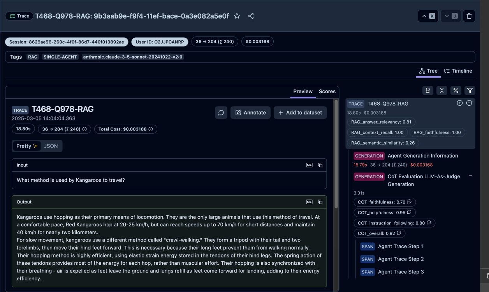

# Amazon Bedrock Agent Evaluation

Bedrock Agent Evaluation is an evalauation framework for Amazon Bedrock agent tool-use and chain-of-thought reasoning with observability dashboards in LangFuse. 

## Existing AWS assets
https://github.com/awslabs/agent-evaluation implements an LLM agent (evaluator) that will orchestrate conversations with your own agent (target) and evaluate the responses during the conversation.

Our repository provides the following additional features: 

## Features

- Test your own Bedrock Agent with custom questions
- Provides the option for LLM-as-a-judge without ground truth reference
- Includes both Agent Goal metrics for chain of thought , and Task specific metrics with RAG, Text2SQL and custom tools
- Observability with integration with Langfuse that includes latency and cost information
- Dashboard comparison for comparison of agents with multiple Bedrock LLMs

## Evaluation Workflow



## Evaluation Results in Langfuse

### Dashboard


### Panel of Traces


### Individual Trace



### Deployment Options
1. Clone this repo to a SageMaker notebook instance
2. Clone this repo locally and set up AWS CLI credentials to your AWS account

### Pre-Requisites

1. Set up a LangFuse account using the cloud https://www.langfuse.com or the self-host option for AWS https://github.com/aws-samples/deploy-langfuse-on-ecs-with-fargate/tree/main/langfuse-v3

2. Create an organization in Langfuse

3. Create a project within your Langfuse organization

4. Save your Langfuse project keys (Secret Key, Public Key, and Host) to use in config

5. If you are using the self-hosted option and want to see model costs then you must create a model definition in Langfuse for the LLM used by your agent, instructions can be found here https://langfuse.com/docs/model-usage-and-cost#custom-model-definitions

### SageMaker Notebook Deployment Steps

1. Create a SageMaker notebook instance in your AWS account

2. Open a terminal and navigate to the SageMaker/ folder within the instance
```bash
cd SageMaker/
```

3. Clone this repository
```bash
git clone https://github.com/aws-samples/amazon-bedrock-agent-evaluation-framework
```

4. Navigate to the repository and install the necessary requirements
```bash
cd amazon-bedrock-agent-evaluation-framework/
pip3 install -r requirements.txt
```

### Local Deployment Steps

1. Clone this repository
```bash
git clone https://github.com/aws-samples/amazon-bedrock-agent-evaluation-framework
```

2. Navigate to the repository and install the necessary requirements
```bash
cd amazon-bedrock-agent-evaluation-framework/
pip3 install -r requirements.txt
```

3. Set up AWS CLI to access AWS account resources locally https://docs.aws.amazon.com/cli/latest/userguide/getting-started-quickstart.html


### Agent Evaluation Options
1. Bring you own agent to evaluate
2. Create sample agents from this repository and run evaluations

### Option 1: Bring your own agent to evaluate
1. Bring your existing agent you want to evaluate (Currently RAG and Text2SQL evaluations built-in)
2. Create a dataset file for evaluations, manually or using the generator (Refer to the data_files/sample_data_file.json for the necessary format)

3. Copy the config_tpl.py into a 'config.py' configuration file and fill in the necessary information
```bash
cp config_tpl.env.tpl config.env
```

4. Run driver.py to run the evaluation job
```bash
python3 driver.py
```

5. Check your Langfuse project console to see the evaluation results!

### Option 2: Create Sample Agents to run Evaluations
Follow the instructions in the [Blog Sample Agents README](blog_sample_agents/README.md). This is a guided way to run the evaluation framework on pre-created Bedrock Agents.

## Security

See [CONTRIBUTING](CONTRIBUTING.md#security-issue-notifications) for more information.

## License

This library is licensed under the MIT-0 License. See the LICENSE file.
